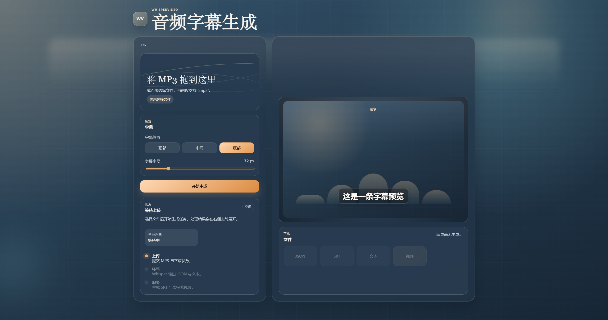

# WhisperVideo

WhisperVideo 是一个基于 FastAPI 的字幕生成工具。

上传音频或视频后，服务会自动完成转写、生成字幕文件，并输出带字幕的视频。页面内可以直接调整字幕位置和字号、查看任务状态、预览结果并下载文件。

## 页面预览



## 功能

- 上传音频或视频文件
- 调整字幕位置
- 调整字幕字号
- 生成转写 JSON
- 生成 SRT 字幕文件
- 生成文本结果
- 生成带字幕视频
- 页面内预览和下载结果

## 当前支持格式

音频：

- `mp3`
- `wav`
- `m4a`
- `aac`
- `flac`
- `ogg`
- `wma`

视频：

- `mp4`
- `mov`
- `mkv`
- `avi`
- `webm`
- `m4v`

## 环境要求

- Python 3.10+
- `ffmpeg`
- Whisper 运行环境

## 安装依赖

```bash
pip install -r requirements.txt
```

如果当前环境还没有安装 Whisper：

```bash
pip install openai-whisper
```

## 配置

项目会优先读取根目录下的 `.env` 文件。

可以先复制示例配置：

```bash
copy .env.example .env
```

示例文件见 [`.env.example`](./.env.example)。

常用配置项：

- `WHISPERVIDEO_HOST`
- `WHISPERVIDEO_PORT`
- `WHISPERVIDEO_WORKSPACE`
- `WHISPERVIDEO_WHISPER_PYTHON`
- `WHISPERVIDEO_WHISPER_MODEL`
- `WHISPERVIDEO_WHISPER_MODEL_DIR`
- `WHISPERVIDEO_WHISPER_LANGUAGE`
- `WHISPERVIDEO_FFMPEG_BIN`

## 启动

在项目根目录执行：

```bash
python -m uvicorn app.main:app --reload
```

启动后访问：

```text
http://127.0.0.1:8000
```

## 使用流程

1. 选择或拖拽一个音频或视频文件
2. 调整字幕位置和字号
3. 点击“开始生成”
4. 等待任务完成
5. 预览视频并下载结果

## 输出文件

任务成功后可下载：

- `JSON`
- `SRT`
- `文本`
- `视频`

运行目录结构：

```text
workspace/
  uploads/   上传文件
  jobs/      任务状态
  outputs/   生成结果
```

## API

### 创建任务

`POST /api/jobs`

表单字段：

- `audio`
- `subtitlePosition`
- `subtitleFontSize`

### 查询任务

`GET /api/jobs/{job_id}`

### 下载结果

- `GET /api/jobs/{job_id}/artifacts/json`
- `GET /api/jobs/{job_id}/artifacts/srt`
- `GET /api/jobs/{job_id}/artifacts/text`
- `GET /api/jobs/{job_id}/artifacts/video`

## 前端文件

- `app/static/index.html`
- `app/static/styles.css`
- `app/static/app.js`

服务启动后，FastAPI 会将 `/` 直接挂载到该静态页面。
